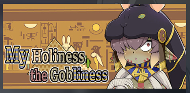
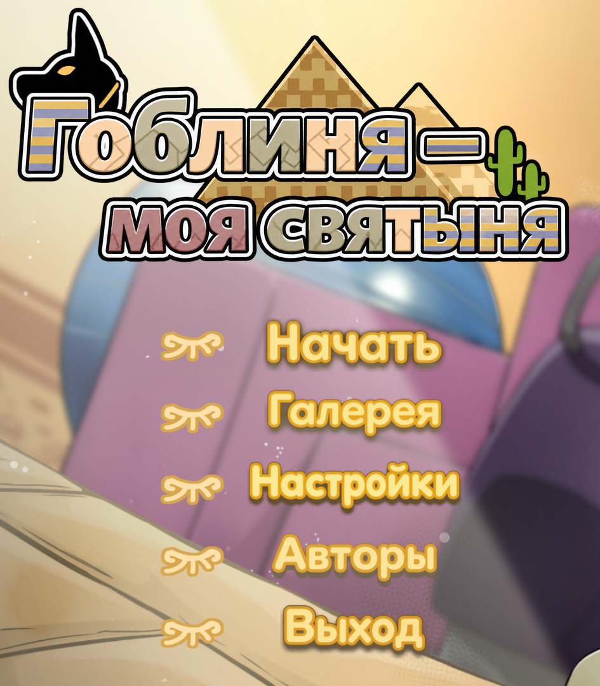
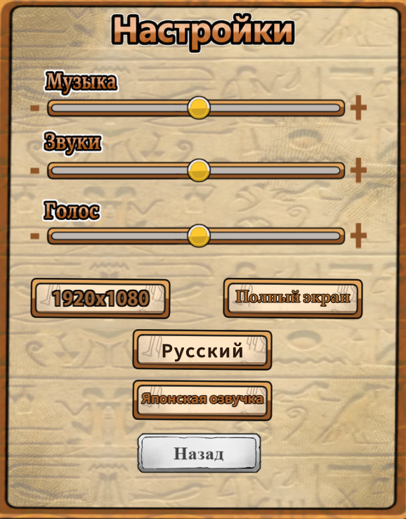
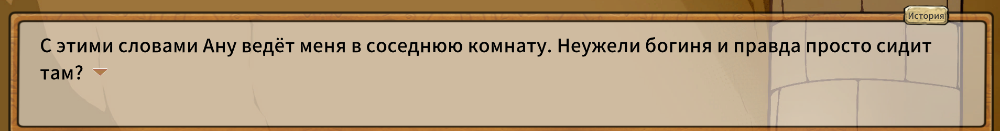
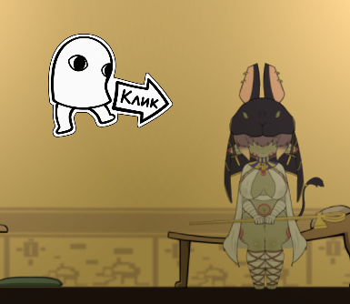

[**My Holiness the Gobliness в Steam**](https://store.steampowered.com/app/2176570/My_Holiness_the_Gobliness/)

# Русификатор My Holiness the Gobliness

Версия русификатора: **1.0.0** 
Поддерживаемая версия игры: **2.2** 
Последнее обновление игры: **23.05.2024** 
Автор: **Disketa**

- [Скачать установщик, архив для ручной установки и PDF-инструкцию для установщика на GitHub](https://github.com/Disketusha/game-russian-localizations/releases/tag/my-holiness-the-gobliness-latest)

## Что изменилось

- Релиз русификатора **1.0.0** для версии игры **2.2**.

## Установка через установщик

1. Закройте игру и запустите `My-Holiness-the-Gobliness-RU-1.0.0-Setup.exe`.
2. Нажмите «Далее». Установщик попробует найти Steam-библиотеку автоматически.
3. Проверьте найденную папку. В ней должны находиться `My Holiness the Gobliness.exe` и папка `My Holiness the Gobliness_Data`. Если путь не найден, нажмите «Обзор» и выберите папку игры вручную.
4. Нажмите «Установить» и дождитесь завершения.
5. Запускайте My Holiness the Gobliness обычной кнопкой «Играть» в Steam.

Во время проверки файлов окно может временно не отвечать. Дождитесь завершения проверки.

Установщик добавляет файлы перевода отдельно и не заменяет штатные файлы игры. PDF-инструкция относится к этому способу установки и скачивается отдельно.

## Ручная установка

1. Закройте игру.
2. В Steam откройте **My Holiness the Gobliness → Свойства → Установленные файлы → Обзор**.
3. Распакуйте ручной архив в отдельную папку.
4. Скопируйте из архива папку `BepInEx` и файлы `winhttp.dll`, `doorstop_config.ini`, `.doorstop_version` в корень игры, рядом с `My Holiness the Gobliness.exe`. Сохраните структуру папок. Файл `readme (инструкция).txt` копировать в игру не нужно.
5. Запустите игру через Steam.

Архив рассчитан на игру без другого русификатора и модов BepInEx. Если в папке уже есть `BepInEx` или `winhttp.dll`, сначала удалите предыдущий перевод или мод его штатным способом. Не смешивайте ручную установку с установщиком и файлы из разных версий русификатора.

## Русский язык

Русский текст включается автоматически после установки. Остальные языки доступны в настройках. Язык озвучки выбирается отдельно.

## Удаление

Версию, поставленную установщиком, удалите через список установленных приложений Windows: **My Holiness the Gobliness — русификатор 1.0.0**.

При ручной установке закройте игру и удалите из её корня только добавленные переводом файлы:

- `winhttp.dll`
- `doorstop_config.ini`
- `.doorstop_version`
- папку `BepInEx`

Не удаляйте всю папку `BepInEx`, если после установки добавляли туда другие моды. Сохранения и оригинальные файлы игры удалять не нужно.

## Пример перевода

  <strong>Главное меню и название игры</strong> 
  

  <strong>Настройки</strong> 
  

  <strong>Диалог</strong> 
  

  <strong>Графическая подсказка</strong> 
  

## FAQ

### Можно запускать игру из Steam?

Да. После установки используйте обычную кнопку «Играть».

### Что делать после обновления игры?

Совместимость с новой версией нужно проверить. Если русский текст пропал или появились ошибки, удалите перевод и дождитесь обновлённого выпуска.

### Windows показывает SmartScreen. Это ошибка?

Нет. Установщик не подписан коммерческим сертификатом. Сверьте SHA-256 с `SHA256SUMS.txt` в релизе и запускайте файл только при совпадении хэша.
