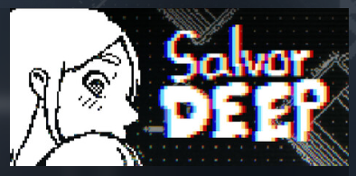
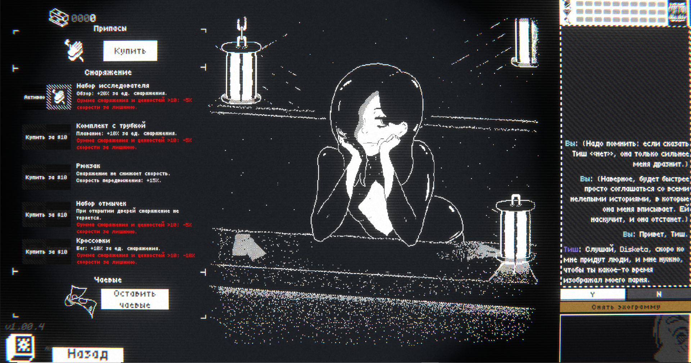
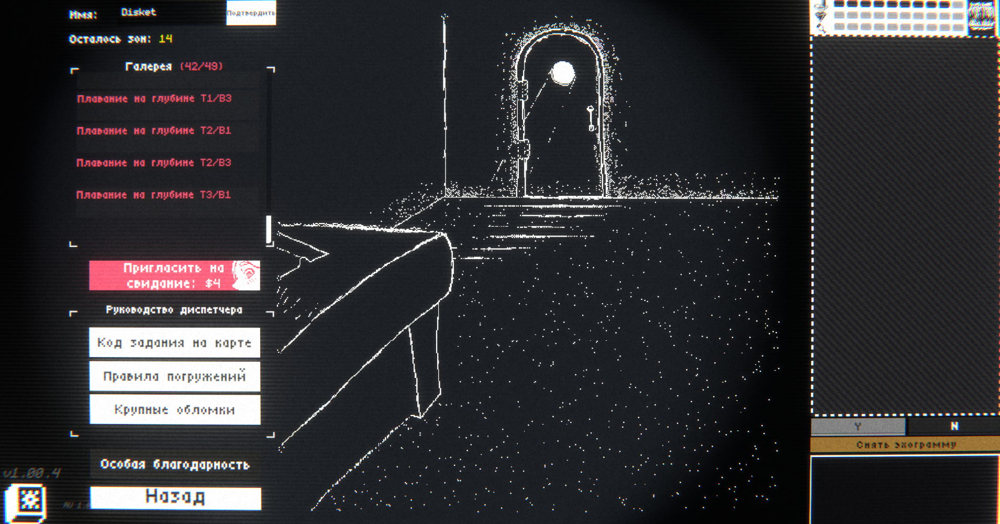
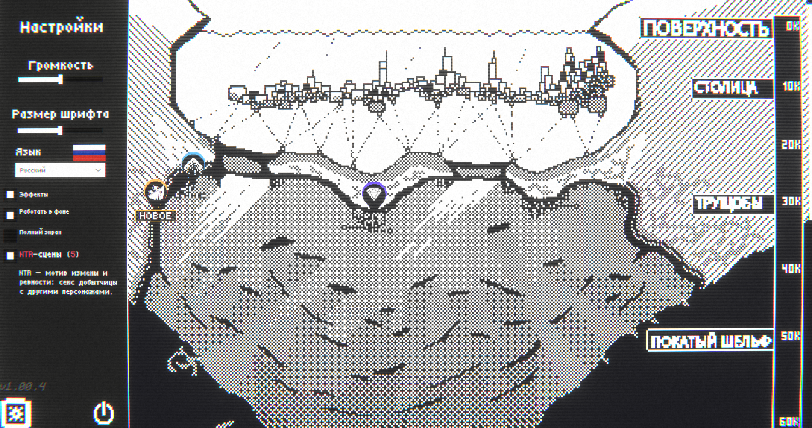
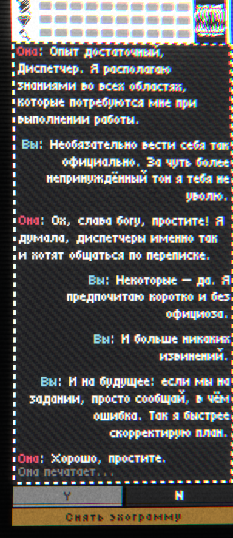

[**Salvor DEEP в Steam**](https://store.steampowered.com/app/3004470/Salvor_DEEP/)

# Русификатор Salvor DEEP

Версия русификатора: **1.0.12** 
Поддерживаемая версия игры: **v1.00.4, Steam build 19211688** 
Автор: **Disketa**

- [Скачать установщик, архив для ручной установки и PDF-инструкцию на GitHub](https://github.com/Disketusha/game-russian-localizations/releases/tag/salvor-deep-latest)

## Установка через установщик

1. Закройте игру и запустите `Salvor-DEEP-RU-1.0.12-Setup.exe`.
2. Нажмите «Далее». Установщик попробует найти Steam-библиотеку автоматически.
3. Проверьте найденную папку. В ней должны находиться `Salvor DEEP.exe` и `Salvor DEEP_Data`. Если путь не найден, нажмите «Обзор» и выберите папку игры вручную.
4. Нажмите «Установить» и дождитесь завершения.
5. Запускайте Salvor DEEP обычной кнопкой «Играть» в Steam.

Установщик не заменяет файлы игры: он добавляет официальный BepInEx 5.4.23.5 и русский плагин. Перед записью файлов установщик проверяет поддерживаемую сборку игры и останавливается при несовпадении.

## Ручная установка

1. Закройте игру.
2. В Steam откройте **Salvor DEEP → Свойства → Установленные файлы → Обзор**.
3. Откроется каталог игры, обычно `…\Steam\steamapps\common\Salvor DEEP`.
4. Скопируйте папку `SDEEP` из архива в открытый каталог.
5. Подтвердите объединение папок и замену файлов.
6. Запустите игру через Steam.

Если в открытом каталоге сразу находятся `Salvor DEEP.exe` и `Salvor DEEP_Data`, вы уже внутри папки `SDEEP`. В таком случае откройте папку `SDEEP` из архива и скопируйте в каталог игры её содержимое.

Архив не содержит файлов самой игры. Если в папке уже есть BepInEx или сторонний `winhttp.dll`, не объединяйте установки вслепую: сначала сохраните их копию или используйте установщик.

SHA-256 ручного архива: `2622c6d5931fe17b5caec899279c73afc5e433305c84089e913a3f024b0e1a4e`.

## Русский язык и его смена

При первом запуске русификатор один раз выберет русский язык и сохранит выбор. После этого язык можно свободно менять в настройках игры.

## Удаление

Версию, поставленную установщиком, удалите через список установленных приложений Windows: **Salvor DEEP — русский перевод**. Сохранения и настройки игры останутся на месте.

При ручной установке удаляйте только файлы, перечисленные в скачанном архиве. Не удаляйте общие файлы BepInEx, если ими пользуются другие моды.

## Пример перевода

  <strong>Магазин и диалог</strong> 
  

  <strong>Галерея и задания</strong> 
  

  <strong>Карта и настройки</strong> 
  

  <strong>Диалог</strong> 
  

## FAQ

### Можно запускать игру из Steam?

Да. После установки используйте обычную кнопку «Играть».

### Windows показывает SmartScreen. Это ошибка?

Нет. Установщик не подписан коммерческим сертификатом. Сверьте SHA-256 с `SHA256SUMS.txt` в релизе и запускайте файл только при совпадении хэша.
