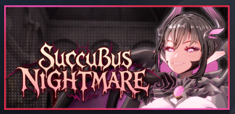
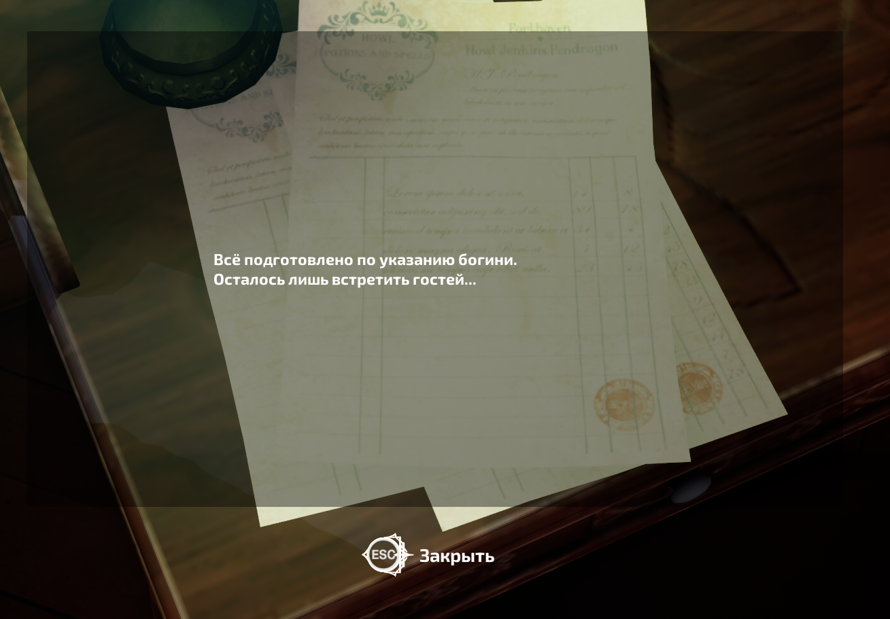
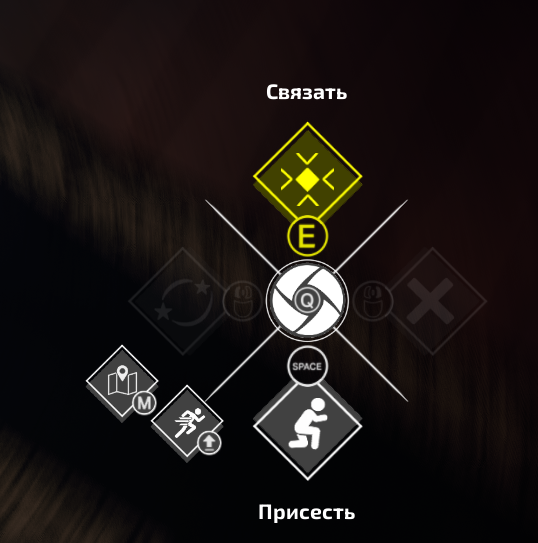
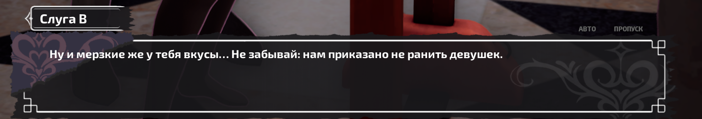
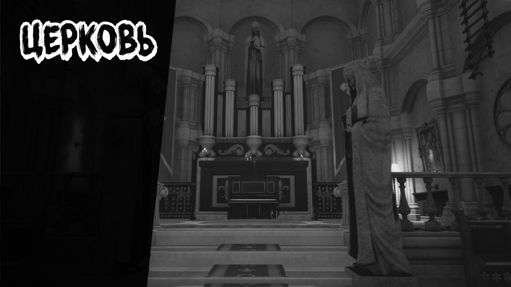

[**Succubus Nightmare в Steam**](https://store.steampowered.com/app/4507930/Succubus_Nightmare/)

# Русификатор Succubus Nightmare

Версия русификатора: **1.0.1** 
Поддерживаемая версия игры: **V1.0.9** 
Автор: **Disketa**

- [Скачать установщик, архив для ручной установки и PDF-инструкцию на GitHub](https://github.com/Disketusha/game-russian-localizations/releases/tag/succubus-nightmare-latest)

## Что изменилось

- Исправлена длинная строка Айи в настройках сцен: «Продвинутая суккубизация» перенесена на две строки, а текст этого блока немного уменьшен.
- Компактное значение «Стандарт» больше не перекрывает соседнюю кнопку; дополнительно проверены переносы строк во всём переводе.

## Установка через установщик

1. Закройте игру и запустите `Succubus-Nightmare-RU-Setup-1.0.1.exe`.
2. Нажмите «Далее». Установщик попробует найти Steam-библиотеку автоматически.
3. Проверьте найденную папку. В ней должны находиться `SN.exe` и папка `SN`. Если путь не найден, нажмите «Обзор» и выберите папку игры вручную.
4. Нажмите «Установить» и дождитесь завершения.
5. Запускайте Succubus Nightmare обычной кнопкой «Играть» в Steam.

Установщик добавляет файлы перевода отдельно и не заменяет штатные файлы игры. Совместимость с текущим небольшим обновлением игры проверена.

## Ручная установка

1. Закройте игру.
2. В Steam откройте **Succubus Nightmare → Свойства → Установленные файлы → Обзор**.
3. Перейдите в папку `SN\Content\Paks`.
4. Скопируйте туда все три файла из архива, не меняя их имена.
5. Запустите игру через Steam.

Три файла являются одним комплектом. Не смешивайте файлы из разных версий русификатора.

## Русский язык

Русский текст включается автоматически после установки. Озвучка остаётся выбранной в настройках игры.

## Удаление

Версию, поставленную установщиком, удалите через список установленных приложений Windows: **Succubus Nightmare — русификатор 1.0.1**.

При ручной установке удалите из `SN\Content\Paks` только эти файлы:

- `SN-Windows_RU_P.pak`
- `SN-Windows_RU_P.utoc`
- `SN-Windows_RU_P.ucas`

## Пример перевода

  <strong>Записка</strong> 
  

  <strong>Подсказки управления</strong> 
  

  <strong>Диалог</strong> 
  

  <strong>Название локации</strong> 
  

## FAQ

### Можно запускать игру из Steam?

Да. После установки используйте обычную кнопку «Играть».

### Что делать после обновления игры?

Небольшие обновления обычно не требуют переустановки русификатора. Если русский текст пропал или появились ошибки, удалите перевод и дождитесь обновлённого выпуска.

### Windows показывает SmartScreen. Это ошибка?

Нет. Установщик не подписан коммерческим сертификатом. Сверьте SHA-256 с `SHA256SUMS.txt` в релизе и запускайте файл только при совпадении хэша.
