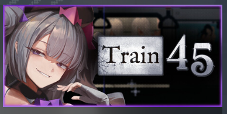

# Русификатор Train 45

Версия русификатора: **1.1.2**
Поддерживаемая Steam-версия игры: **1.0.5.1**
Автор: **Disketa**

Скачать готовый установщик и PDF-инструкцию: [Train 45 — русификатор 1.1.2](https://github.com/Disketusha/game-russian-localizations/releases/tag/train45-v1.1.2).

## Что исправлено в 1.1.2

- боковая вкладка меню паузы теперь использует утверждённую русскую текстуру «Пауза»;
- `(Shift)` больше не накладывается на заголовок «ЗАМЕТКИ».

## Установка

1. Запустите `Train45-RU-Patcher-1.1.2.exe`.
2. Проверьте путь к штатному `Train45.exe`. Обычно установщик находит Steam-версию автоматически; при необходимости нажмите «Обзор».
3. Выберите, создавать ли резервную копию оригинального EXE. Галочка включена по умолчанию.
4. Если резервная копия включена, проверьте автоматически предложенную папку или укажите другую. Папка должна находиться вне каталога самой игры.
5. Проверьте параметры и нажмите «Установить».
6. После завершения запускайте Train 45 обычной кнопкой «Играть» в Steam.
7. До переключения интерфейс игры будет английским: откройте **Settings → Game → Language** и выберите **Русский**.

Установщик изменяет штатный `Train45.exe`, поэтому отдельный ярлык или отдельный EXE для запуска не требуется.

## Резервная копия и удаление

С резервной копией деинсталлятор возвращает проверенный оригинальный `Train45.exe`.

Без резервной копии деинсталлятор удаляет только распознанный русский EXE. Чтобы вернуть оригинал, откройте в Steam свойства игры, раздел «Установленные файлы» и выполните проверку целостности файлов.

Если игра или резервная копия были перемещены, деинсталлятор предложит указать нужный файл вручную. Можно продолжить без восстановления и затем вернуть оригинал через Steam.

## FAQ

### Можно запускать игру из Steam?

Да. После установки используйте обычную кнопку «Играть».

### Что будет, если снять галочку резервной копии?

Русификатор установится нормально. При его удалении русский `Train45.exe` будет удалён, а оригинал потребуется вернуть проверкой файлов Steam.

### Что делать, если деинсталлятор не находит игру или бэкап?

Укажите `Train45.exe` или сохранённую копию вручную. Если копии больше нет, продолжите удаление без восстановления и выполните проверку файлов в Steam.

### Что делать после обновления игры?

Установщик предупредит, что версия EXE не проверена, и позволит продолжить на свой риск. Если бинарный патч несовместим, проверка готового русского EXE завершит установку без замены исходного файла. Для надёжного результата используйте выпуск русификатора, в котором явно указана поддержка новой версии игры.

### Windows показывает SmartScreen. Это ошибка?

Нет. Установщик не подписан коммерческим сертификатом. Сверьте его SHA-256 с `SHA256SUMS.txt` и выберите запуск вручную, если хэш совпадает.

### Как удалить русификатор?

Откройте список установленных приложений Windows и удалите **Train 45 — русский патч**.

Каталог [`game-files`](./game-files/) содержит только файлы игры, которые меняются русификатором.
