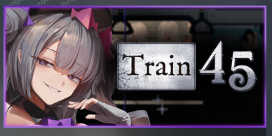
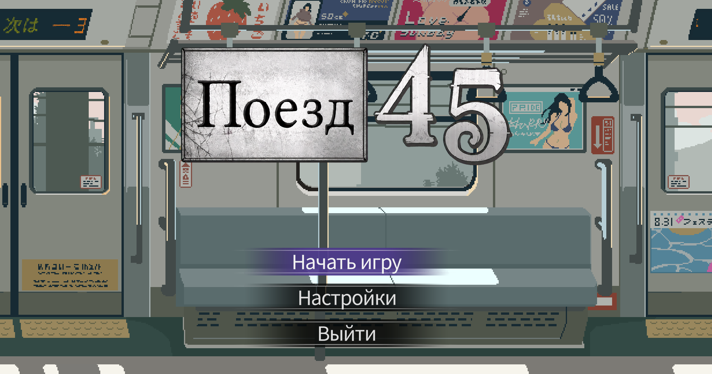
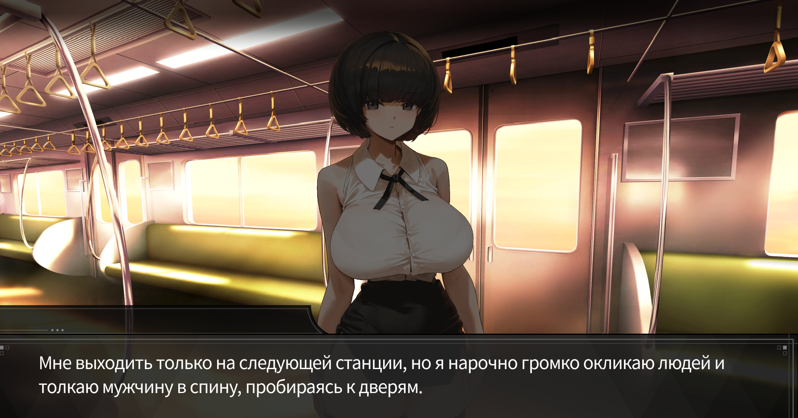
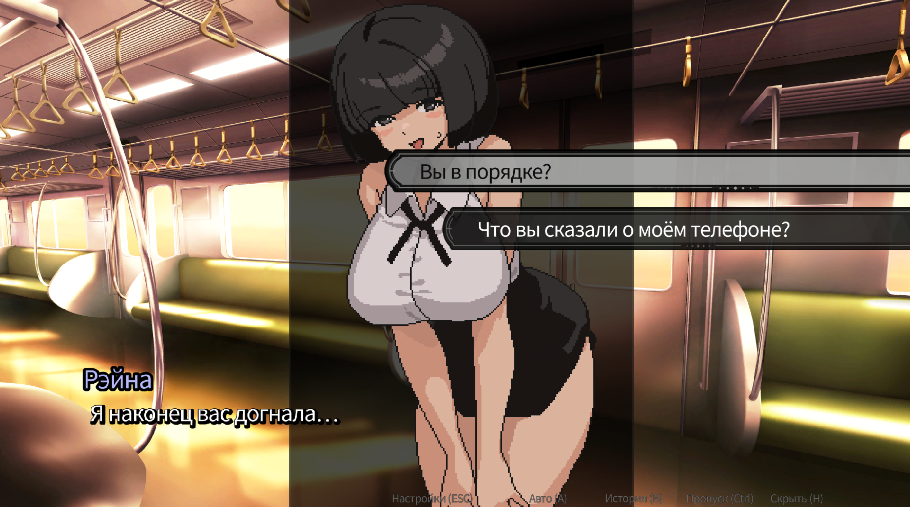
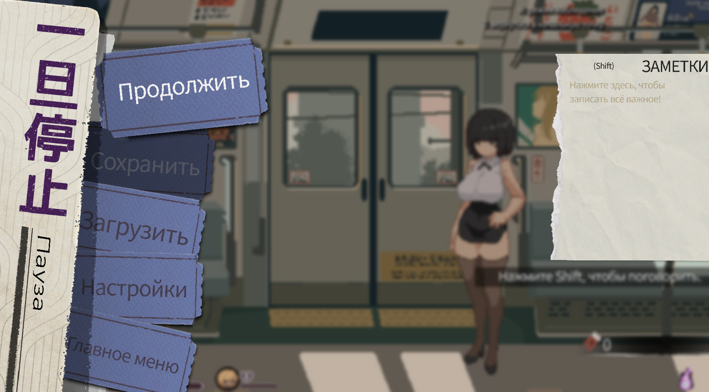
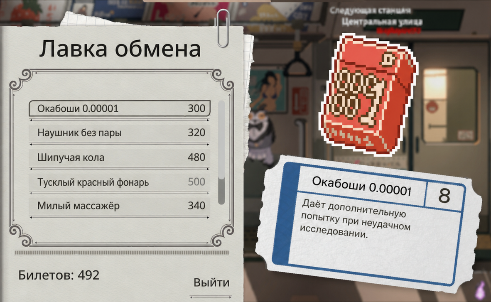
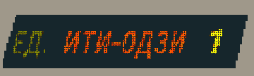

[**Train 45 в Steam**](https://store.steampowered.com/app/3711590/Train_45/)

# Русификатор Train 45

Версия русификатора: **1.2.1**
Проверенная Steam-версия игры: **1.0.6.4**
Автор: **Disketa**

Скачать актуальный установщик и PDF-инструкцию: [Train 45 — последняя версия русификатора](https://github.com/Disketusha/game-russian-localizations/releases/tag/train45-latest).

[Руководство по русификатору в Steam](https://steamcommunity.com/sharedfiles/filedetails/?id=3765850739)

## Установка

1. Запустите `Train45-RU-Patcher-1.2.1.exe`.
2. Проверьте путь к штатному `Train45.exe`. Обычно установщик находит Steam-версию автоматически; при необходимости нажмите «Обзор». После нажатия «Далее» проверка большого файла может занять некоторое время; окно установщика может ненадолго перестать отвечать.
3. Выберите, создавать ли резервную копию оригинального EXE. Галочка включена по умолчанию.
4. Если резервная копия включена, проверьте автоматически предложенную папку или укажите другую. Папка должна находиться вне каталога самой игры.
5. Проверьте параметры и нажмите «Установить».
6. После завершения запускайте Train 45 обычной кнопкой «Играть» в Steam.
7. До переключения интерфейс игры будет английским: откройте **Settings → Game → Language** и выберите **Русский**.

Установщик изменяет штатный `Train45.exe`, поэтому отдельный ярлык или отдельный EXE для запуска не требуется.

## Резервная копия и удаление

С резервной копией деинсталлятор возвращает точный оригинальный `Train45.exe`, использованный при установке.

Без резервной копии деинсталлятор удаляет только распознанный русский EXE. Чтобы вернуть оригинал, откройте в Steam свойства игры, раздел «Установленные файлы» и выполните проверку целостности файлов.

Если Steam уже обновил игру после установки русификатора, деинсталлятор не перезапишет новый EXE. При необходимости оригинал можно вернуть проверкой файлов Steam.

## Пример перевода

  
  

  
  

  

## Перевод анимации

  

## FAQ

### Можно запускать игру из Steam?

Да. После установки используйте обычную кнопку «Играть».

### Что будет, если снять галочку резервной копии?

Русификатор установится нормально. При его удалении русский `Train45.exe` будет удалён, а оригинал потребуется вернуть проверкой файлов Steam.

### Что делать, если деинсталлятор не находит игру или бэкап?

Укажите `Train45.exe` или сохранённую копию вручную. Если копии больше нет, продолжите удаление без восстановления и выполните проверку файлов в Steam.

### Что делать после обновления игры?

Установщик проверяет структуру встроенных ресурсов и каждый файл, который меняет русификатор. Небольшое обновление может быть принято автоматически, если оно не затронуло эти ресурсы. При конфликте установка остановится до замены `Train45.exe`; продолжения «на свой риск» больше нет.

### Windows показывает SmartScreen. Это ошибка?

Нет. Установщик не подписан коммерческим сертификатом. Сверьте его SHA-256 с `SHA256SUMS.txt` и выберите запуск вручную, если хэш совпадает.

### Как удалить русификатор?

Откройте список установленных приложений Windows и удалите **Train 45 — русский патч**.
